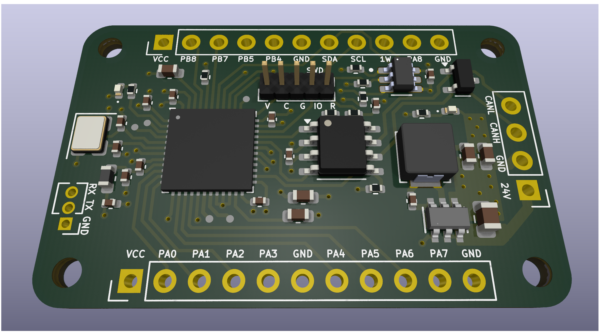
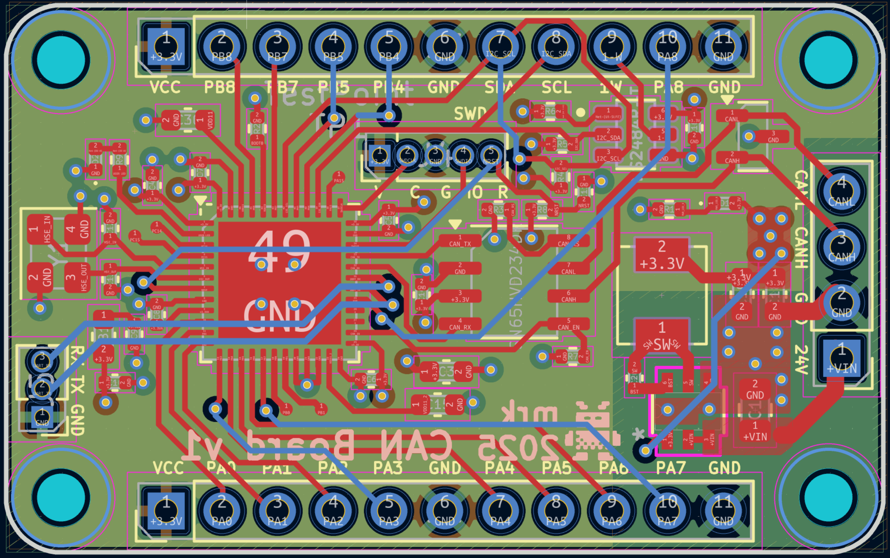

# STM32 CAN Node

# Features

* modern STM32 MCU (U3/U5 series)
* integrated CAN transceiver
* integrated 1-wire master controller (over i2c)
* integrated step-down converter (24V -> 3.3V)
* 2.54 pin headers exposing 15 GPIOs
* separate SWD connector for flashing / debugging
* small form factor (40mm x 25mm)

